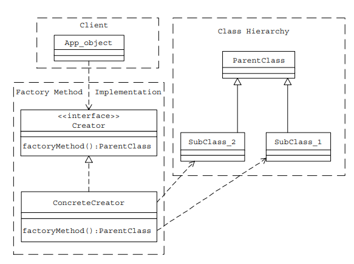

# Factory Method
## Creational Design Pattern

### Schema

 + What you can di with an Abstract Factory
    - Allows you to create families of related objects without specifying a concrete class
    - Use when you have many objects that can be added, or changed dynamically during runtime
    - You can model anything you can imagine and have those objects interact through common interfaces.

